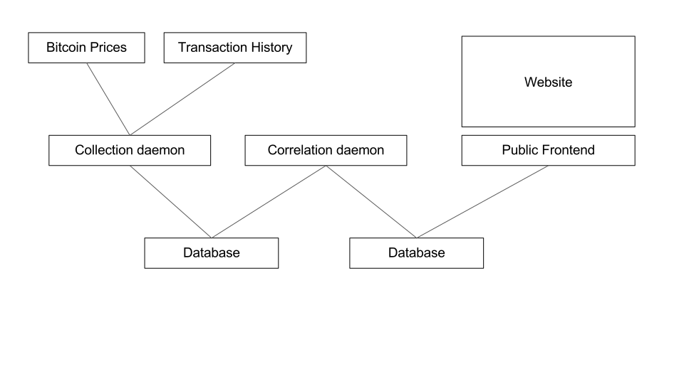

# Bitcoin Price

## Introduction

[Bitcoin](https://bitcoin.org/en/) is a ground-breaking new digital currency created by the infomous [Satoshi Nakamoto](https://en.wikipedia.org/wiki/Satoshi_Nakamoto), released on the 3rd of January 2009. It's praised by critics for it's low fees on transactions, infinite scalability, nation-irrelevance, and mathematically-secure form of exchange, which allows for no authoritative body or super-user. This has many advantages as it stops censorship, governmental abuse, and currency controls such as [Quantitative Easing](https://en.wikipedia.org/wiki/Quantitative_easing).

Where traditional currencies uses methods such as Quantitative Easing, a procedure where the central bank will 'print' (electronically create) money then buy government assets to promote 'growth' in the economy, Bitcoin has an democratic culture where no central bank, no government, is physically possible to exist.

Bitcoin relies on a system pioneered by Satoshi, known as the 'blockchain', where all transactions are stored on all computers (nodes) within the Bitcoin network. This means that everyone has a copy of all trades ever taken place, and thus can check the validity of new transactions sent across the network.

## Aims of this project

In this project, I am trying to find detailed correlations between transaction throughput (both in quantity and monetarily), and the current price of Bitcoin, in fiat currency such as the US Dollar, Great British Pound, or the Euro. This has been investigated before, but has never been properly released to the public due to capitalist intentions. I plan to make all of my findings available to the wide public, with interactive and easy-to-understand graphical explanations.

## Technical procedure

In overview, I plan to use free, open-source software such as [Node.js](https://nodejs.org/en/), [MongoDB](https://www.mongodb.org/), and [Bitcore](https://bitcore.io/).

I'll then write the following software packages:

### Collection daemon

This software package will fulfill two data jobs, syncing their time periods:

* Pull previous Bitcoin prices from the [Blockchain.info](https://blockchain.info/), [CoinDesk](http://www.coindesk.com/), or [BitcoinAverage](https://bitcoinaverage.com/) public API, and then save to a local MongoDB database.

* Scrape blocks (groups of transactions) from the Bitcoin blockchain, using the [Bitcore](https://bitcore.io/) API.

### Correlation daemon

This daemon will attempt to correlate the locally saved transaction and price data, using my designed algorithm. (to be continued).

### Public site

After writing the previous two packages, I plan to write a public-facing site, showing my findings in graphable and interactive form.

